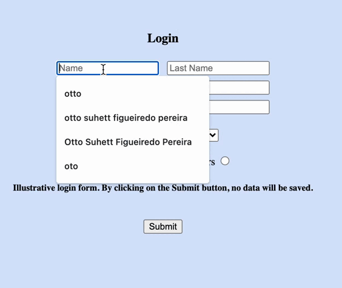

# HTML BASIC LOGIN FORM
📋

A basic project, where I have made a login form.
In this project I have used some tags like section,select and some types of input.

[]

## Technologies
- HTML 5 🏗
- CSS 3  🎨

## Contact
I'm open to feedback, new ideas or suggestions. 🤖
